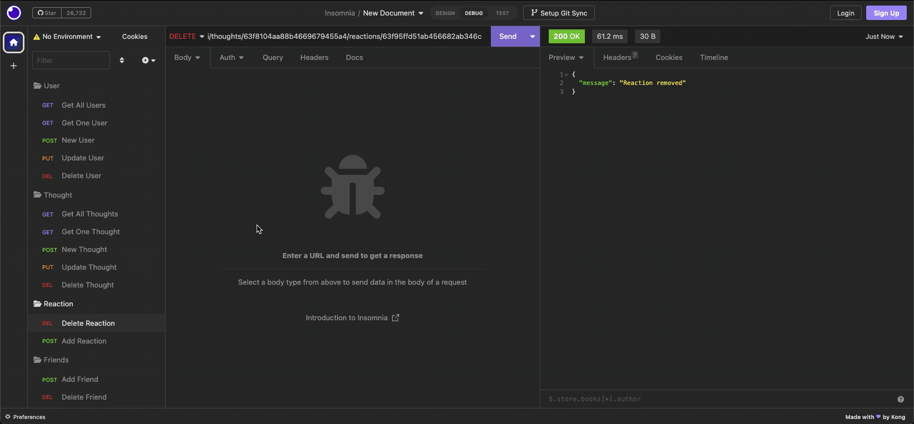

# Social Network API

## Description

This application contains the routes and models necessary for users to share their thoughts and react to friend's thoughts and to build a friend list. The application utilizes Express and Mongoose/MongoDB.

## Table of Contents

- [Installation](#installation)
- [Usage](#usage)
- [Questions](#questions)

## Installation

Run `npm install` to install necessary dependencies.

## Usage

You can start the application use `npm run start` when cloned. You'll then use a tool such as Insomnia to test the routes available. I've created a couple of videos to go over each of the routes:

## Questions

You can contact me via email at [gdjewell@gmail.com](mailto:gdjewell@gmail.com) or on Github at [@gdjewell](https://github.com/gdjewell).
